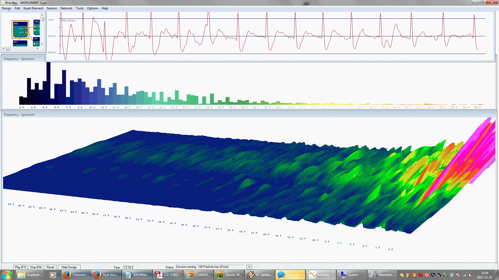
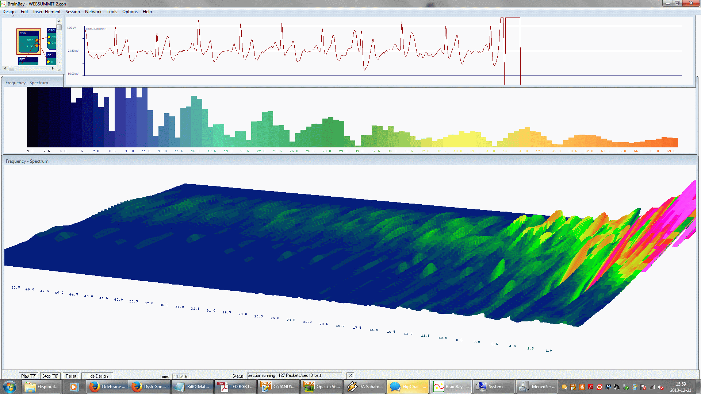
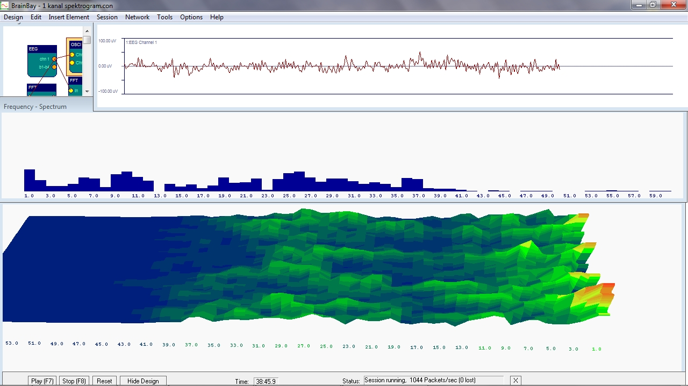
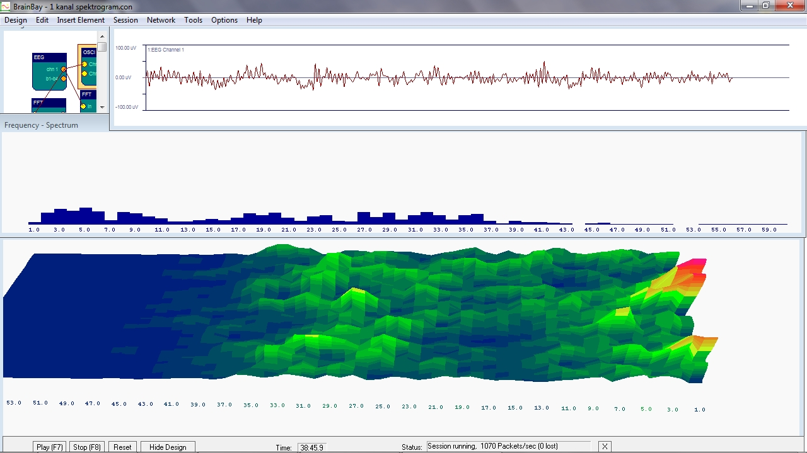
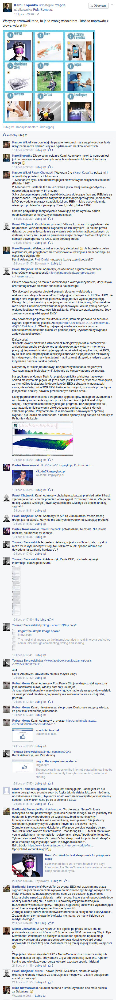
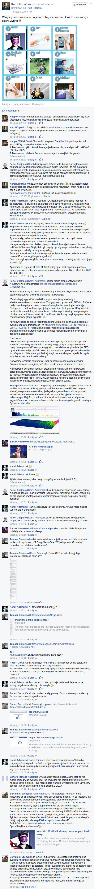

Title: NeuroOn: król jest nagi!
Date: 2014-07-27 12:00
Category: startup, NeuroOn

> *Cytat usunięty na prośbę autora. Całość konwersacji na temat NeuroOna znajduje się w linkach poniżej.*

W grudniu 2013 roku na Kickstarterze pojawił się głośno zapowiadany projekt polskiego startupu [Intelclinic]: [NeuroOn]. Wspaniale rozkręcony marketingowo produkt obiecujący przynieść współczesnym ludziom to, czego potrzebują chyba najbardziej: więcej czasu. Czasu, który mieliby zdobyć nie marnując go na sen, bo przecież jest to jawne jego marnotrawstwo, czyż nie?

Bez zbędnego opisywania naprawdę dobrze zrobionej kampanii, która mówi sama za siebie, skupię się na jej istocie. Jest nią bowiem maska, która za pomocą trzech suchych elektrod umieszczonych na łuku brwiowym / czole mierzy       sygnały [EEG] (fal mózgowych), [EOG] (ruchów oczu) oraz [EMG] (ruchów mięśni twarzy). Następnie przetwarzane są one przez "wzmacniacz biologiczny”, który decyduje, jak wybudzić nas tak, abyśmy mimo małej ilości snu byli rześcy i wypoczęci.

Przedłużone stosowanie NeuroOna ma prowadzić do wyćwiczenia się i redukcji potrzeby bezsensownego leżenia z zamkniętymi oczami do nie więcej niż czterech godzin dziennie! Posiada on także dodatkowe tryby, mogące umożliwić między innymi uzyskanie świadomego snu.

To wszystko za jedyne $250. Albo $700 dla wścibskich naukowców, którzy chcą przyjrzeć się czemuś więcej niż fikuśnej aplikacji na iPhone i Androida.

Produkt wypróbowany był między innymi przez Prezydenta Bronisława Komorowskiego czy rapera 50-centa! Zdobył również wiele prestiżowych nagród startupowych; był między innymi finalistą prestiżowego Singularity University Central and Eastern Europe.

I jak dotąd Intelclinic nie przedstawiło ani jednego dowodu na jego działanie, zasłaniając się buzzwordami, mąceniem, "tajemnicami patentowymi", małą liczbą egzemplarzy do testów, a w końcu atakami ad personam.

Pierwszy raz bliski kontakt z NeuroOnem miałem na [HumanTechArt]cie 19go grudnia w Warszawie. Byłem niezwykle zaintrygowany - pomijając nawet całą kwestie snu polifazowego, możliwość zbierania rzetelnego i czystego EEG z twarzoczaszki (więcej: jednego kanału, trzech elektrod!) niewątpliwie posunęłoby neuronauki o LATA do przodu, gdyż nie udało się to dotąd ani żadnej jednostce akademickiej, ani firmie - włączając w to tak Google, jak i DARPA.

Jedynym znanym na rynku wyjątkiem może być produkt nieistniejącej już firmy [ZEO], działający na bardzo podobnej zasadzie co NeuroOn. O ile jednak całościowo osiągał on ponad [75% zgodności] z profesjonalnym [polisomnografem], ze względu na bardzo częste wykrywanie fazy REM w pierwszych sześciu minutach snu absolutnie nie nadawał się on do codziennej analizy.

Przyszedłem więc sceptyczny, oczekując przynajmniej zajawki niezwykle złożonego algorytmu odszumiającego, jakiś rozwiązań, o których nikt wcześniej nie pomyślał. Zamiast tego usłyszałem półgodzinny wykład o marketingu, zdobywaniu sponsorów i sprawnej manipulacji mediami. Byłem rozczarowany.

Przygotowałem się jednak dość dobrze i z plikiem publikacji naukowych pokazujących niemożliwość tego rozwiązania, zapytałem Kamila Adamczyka, CEO NeuroOna - jak działa ich produkt? Usłyszałem na to bezczelne wręcz (cytat z pamięci) - "Nie mam pojęcia, jak działa. Nasz inżynier zapewnia mnie, że działa, więc mogę to potwierdzić." CEO zasugerował, żebym zakupił model za 700 dolarów i czekał do premiery, aby dostąpić zaszczytu przyjrzenia się sygnałowi - lub skonsultował się z ich inżynierem.

Tak więc zrobiłem poprzez następujący email:

>Proszę mi wytłumaczyć, jak trzy suche elektrody mają badać jednocześnie EMG, EOG i EEG? Rozumiem - po spoceniu się przez użytkownika mogą wykryć, CZY rusza oczami, ale na pewno nie w jaki sposób nimi porusza. Nie dacie rady zanalizować sensownie fal mózgowych, nie z takimi zakłóceniami z mięśni, z odlepiających się elektrod. Okej, rozumiem, że wykryjecie REM / nREM, ale nic ponadto, toteż hasła o "EMG, EOG i EEG" są z Waszej strony oszustwem skierowanym do nietechnicznych konsumentów.
>Chciałbym zobaczyć jakiś dowód, że ta maska działa, jeżeli mam wydać na nią pieniądze. Nie proszę o dostęp do kodu, ale chciałbym zobaczyć przykładowy sygnał przez nią zbierany wraz z omówieniem - i wynikiem działania czarnej skrzyneczki.
>Podczas ostatniego spotkania Human Tech Art pytałem o to Kamila, który jednak nie był w stanie odpowiedzieć, na jakiej zasadzie działa Wasz produkt.

Odpowiedź Janusza Frączka odpowiedzialnego w Intelclinic za hardware maski brzmiała następująco (cytaty dosłowne):

>Niezmiernie cieszę się z Pańskiego zainteresowania naszym projektem. Do akwizycji sygnałów bioelektrycznych stosujemy elektrody z elektroprzewodzących materiałów. Tradycyjne urządzenia do EEG lub EKG nie będą z nimi współpracować, ponieważ mają bardzo wysoką rezystancję. Dlatego też, zbudowaliśmy specjalny wzmacniacz biologiczny, który świetnie radzi sobie z utrudnionymi warunkami pomiarowymi. Wielką zaletą naszych elektrod jest brak konieczności ich zwilżania. Wystarczy przyłożyć palce, żeby zaobserwować gładki sygnał EKG.

Sygnały EEG i EKG różnią się istotnie, gdyż EKG jest o rząd wielkości "głośniejsze” niż sygnał z mózgu, a opisywane elektrody suche nie dają odpowiedniej jakości sygnału nawet w znacznie większej ilości i lepszej konfiguracji na mózgoczaszce! Za Wydziałem [Fizyki UW]: "Według najlepszej wiedzy nie została jeszcze skonstruowana elektroda sucha, za pomocą której uzyskiwano by sygnał o zadowalającej jakości.".

>Skonstruowany przez nas wzmacniacz biologiczny potrafi automatycznie zmieniać parametry swojego toru analogowego, aby w danym momencie precyzyjnie prowadzić akwizycję sygnału o tak wielkiej amplitudzie, jak EKG, by za kilka sekund przejść do akwizycji słabszych niż pojedyncze mikrowolty - fal mózgowych. Nie ma w tym żadnej magii czarnej skrzynki, a jedynie czysta inżynieria i nasze autorskie patenty.

Ponownie, "wzmacniacz biologiczny” oznacza *zapewne* sieć neuronową, jednak nie ma ani słowa o szczegółach - jak z jednego kanału różnicowego odfiltrować można ruchy mięśni i oczu, aby uzyskać coś lepszego niż skomplikowany generator liczb losowych?

>W załączniku umieściłem kilka zarejestrowanych przez nas przebiegów: EKG, EEG oraz EOG. Na spektrogramie z łatwością dostrzeże Pan udział poszczególnych składowych częstotliwościowych, które bardzo dobrze różnicują choćby stan relaksu i koncentracji, które następowały po sobie w odstępach 15 sekundowych.

Pisząc tego emaila szczerze liczyłem na próbki sygnału - to znaczy pliki z danymi z urządzenia do obróbki w Pythonie lub Matlabie. Otrzymałem screenshoty bez załączonej legendy, opisu ułożenia elektrod, ani podstawowych danych. Za to z Winampem w tle.

Wedle wszelkiej dostępnej tak mnie, jak i wszystkim neuronaukowcom, z którymi się konsultowałem wiedzy, nie ma możliwości uzyskania odpowiedniego sygnału EEG z takim ustawieniem suchych elektrod. Z powodu zastosowania taktyki "czarnej skrzynki” nie sposób będzie sprawdzić na jakiej podstawie urządzenie decyduje o wybudzeniu użytkownika. Nawet użycie zestawu za $700 nie przyniesie efektu ze względu na niepowtarzalność EEG i możliwość wpłynięcia najmniejszych fluktuacji na sieć neuronową. Intelclinic stworzył więc idealny, niefalsyfikowalny produkt do marketingu.

Co ciekawe, w zespole tej firmy nie ma ani jednego neurofizyka czy neuroinformatyka specjalizującego się w sygnałach z ludzkiego mózgu. Doświadczenia Kamila z neurofizjologią i neurofizyką snu wydają się ograniczać do tego, iż rzeczywiście "w trakcie studiów dużo nie spał i próbował snu polifazowego”, ale każde szczegółowe pytanie zbywa machnięciem ręki.

Na tym etapie jasnym już dla mnie było, że NeuroOn jest przekrętem mającym wyłudzić z naiwnych i nie mających wiedzy naukowej ludzi pieniądze. Intelclinic oferował bardzo "błyszczący” projekt, miał świetny marketing, nic nie mogło pójść nie tak. Na Kickstarterze uzyskali w sumie $438 573, czyli ponad 1 345 000 złotych.

Jak się okazuje, nie byłem jedynym, który zauważył, że coś jest nie tak. Bardzo dobre analizy stworzyli między innymi **[neurocritic]** oraz **[taking a cat apart]**.

Mimo kilku prób nie udało mi się jednak zdobyć zainteresowania ani mediów, ani autorytetów polskich neuronauk, zanim kampania Kickstarterowa projektu dobiegła końca. Postanowiłem więc w ciszy doczekać nieuniknionej klapy największego polskiego startupu hardwareowego ostatnich lat.

Wszystko zmieniła jednak [ta dyskusja] na Facebooku. Dla nie korzystających z serwisu lub w razie jej usunięcia, link do grafiki:

  

**Dziękuję za zwrócenie uwagi na błąd: na pierwszym obrazku nie było widać odpowiedzi Kamila, który dodał mnie do użytkowników ignorowanych.**

  

Kamil Adamczyk (CEO NeuroOna) wydaje się nie być w stanie znieść jakiejkolwiek krytyki produktu, a dodatkowo rozjuszają go prośby o źródła i dowody. Kilka cytatów z dyskusji:

>Kamil Adamczyk: Po pierwsze, NeuroOn to nie maszynka do snu polifazowego, tylko coś zupełnie innego. To, że jesteśmy tak odbierani to prawdopobodnie po części nasz błąd komunikacyjny, po części specyfika polskich mediów- bo za granicą jesteśmy odbierani zupełnie inaczej. 

Ze strony Kickstartera NeuroOna: "NeuroOn: World's first sleep mask for polyphasic sleep”

>Kamil Adamczyk: Po drugie nie za bardzo wiem czym miałby się u nas zajmować neurofizyk lub biofizyk tym bardziej (pomijając fakt, iż są to słowa wytrychy- tak samo zresztą jak haker, albo mój ulubiony- neurohaker :D). Po trzecie nie sądzę, by którykolwiek z naszych inżynierów pokazał Ci wszystkie próbki.

Rzetelną interpretacją i analizą sygnału, która wydaje się umykać tak studentowi medycyny, jak i inżynierowi technik komputerowych w medycynie.

Dyskusja przeniosła się do [innego wątku], obrazek:

  

Zaczęła się ona porównania do kreacjonistów:
>Kamil Adamczyk: Pawle, zawsze się taki znajdzie co będzie głośno krzyczeć.
http://www.angelfire.com/mp/david/Tracts/Evo.html

Po raz pierwszy usłyszałem też o współpracy NeuroOna z [National Sleep Foundation]. Przyznaję, że o tej organizacji usłyszałem po raz pierwszy w życiu - nie jestem jednak pewien natury współpracy. Z terminem dostarczenia pierwszych urządzeń ustalonym na maj tego roku (dwa miesiące przed napisaniem tego blogposta) ciężko raczej mówić o rzetelnych badaniach klinicznych z podwójnie ślepą próbą. Bardziej prawdopodobne jest zakupienie znaczka "Certified by” na zasadzie zakupowania "godła konsumenta".

W końcu, pod natłokiem krytyki CEO NeuroOna zmienił ustawienia prywatności dyskusji tak, aby osoby spoza jego listy znajomych nie mogli jej zobaczyć. To wywołało jeszcze większą burzę, w tym oskarżenia o kasowanie krytyki. W odpowiedzi dyskusja pojawiła się ponownie, a Kamil odmówił dalszego wypowiadania się prosząc o kontakt mailowy.

Niewątpliwie słuszna marketingowo decyzja.

**Podsumowując:**

Maska NeuroOn z pewnością nie działa tak, jak jest reklamowana - nie używa EEG. Może z bardzo niską dokładnością wykrywać fazę REM, jednak nie pozwoli na rzetelną analizę snu. Ogromna część populacji i tak nie osiągnie snu polifazowego, gdyż ich mózgi po prostu tak nie działają. Maska z pewnością też nie pozwoli na świadome śnienie. Będzie tylko mało przydatną zabaweczką do odłożenia na półkę po kilku nocach.

Cały marketing Intelclinic opiera się na buzzwordach, niedopowiedzeniach, przeinaczeniach i machaniu rękami. Pora, aby ktoś wreszcie powiedział: ta maska nie ma prawa działać. Nie pozwólmy się bezczelnie oszukiwać przez ludzi nie mających pojęcia, jak działa ich własny produkt!

[NeuroOn]:https://www.kickstarter.com/projects/intelclinic/neuroon-worlds-first-sleep-mask-for-polyphasic-sle
[Intelclinic]: http://www.intelclinic.com/
[EEG]:http://pl.wikipedia.org/wiki/Elektroencefalografia
[EMG]:http://pl.wikipedia.org/wiki/Elektromiografia
[EOG]:http://pl.wikipedia.org/wiki/Elektrookulogram
[ZEO]:http://en.wikipedia.org/wiki/Zeo,_Inc.
[75% zgodności]:http://onlinelibrary.wiley.com/doi/10.1111/j.1365-2869.2011.00944.x/abstract
[polisomnografem]:http://pl.wikipedia.org/wiki/Polisomnografia
[HumanTechArt]: http://www.humantechart.pl/2013/12/human-tech-art-vol-5-tuz-przed-swietami.html
[Fizyki UW]: https://brain.fuw.edu.pl/edu/EEG:Pracownia_Sygna%C5%82%C3%B3w_Biologicznych/Zaj%C4%99cia_1
[neurocritic]: http://neurocritic.blogspot.ch/2014/01/neurocrap-funded-by-masses-neuroon-and.html
[taking a cat apart]: http://takingapartcats.wordpress.com/2014/01/13/nonsense-neurogadgets-sleep-edition/
[ta dyskusja]: https://www.facebook.com/karol.kopanko/posts/803667443007101
[innego wątku]: https://www.facebook.com/kkadamcz/posts/10203475655285471
[National Sleep Foundation]: http://sleepfoundation.org/
