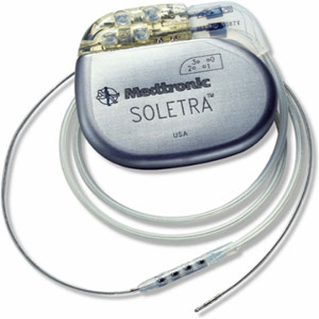

Title: Cyborg's daily problems: the story
Slug: cyborgs-daily-problems-the-story
Date: 2014-09-01 22:00
Lang: en

We used to read about technologies radically changing our bodies and minds in science fiction. With time, such ideas started appearing in scientific journals, often bizarrely misinterpreted by journalists, claiming impending telekinesis or telepathy for everybody. They stayed out of scopes of normal people's lives, with a status of almost a legend, not closer than Moon landing or Mars exploration.

Very few people are aware that technologies such as cyborgization (and I'm not afraid to use that word) are available now and are a way of treating very real patients in the hospitals. These aren't shiny, chromed implants* allowing to throw cars around and jump over buildings - these are medical devices used to treat conditions we weren't able to cure before. And they come with all the drawbacks of regular health insurance: you have to wait two months to have a knee surgery? Well, a cyborg has to wait over a year to get new batteries.

Even with such an introduction, this is not an essay unrelated to reality.

Several months ago I met a girl - Suzanne - with two (symmetric) implants in her [globus pallidus]. Normally you wouldn't notice them, unless you counted arteries on her neck - as she appears to have two extra ones. In reality, these are cables connecting the electrodes in her brain with neurostimulators implanted in her clavicles. That's really a clever thing, allowing to swap batteries and make adjustments you can't make with a wireless remote - all without opening the skull..

And what superpower do they give her? Well, she walks and uses her hands as we are all able to - naturally. Suzanne was born with [dystonia], a severe neurological disorder worsening over time, rendering her unable to use her hands or legs precisely. It started when she was 10 years old - and by the time she reached mid school, Suzanne wasn't able to walk on her own.

Luckily, a neurosurgeon and researcher has heard about her case and decided to accept her to an experimental program, qualifying her for a pair of neurostimulators. All state-funded, no hidden costs - all she had to do was agree to have a research paper written about her. Two months of convalescence after the first operation Suzanne was able to walk and write, returning to her normal life.

There were problems, of course. The cable has worn away, needing to be replaced, the electrode has slipped a little. After a total of three years Suzanne was a fully-functional cyborg. She didn't need more than four days to go from surgery to being fully alive, and you wouldn't be able to tell that she ever had any problems with walking, writing, holding things and even juggling.

Yeah, science!

When I met Suzanne two years later, she was barely limping on her crutches. What happened? Have the electrodes corroded? The brain - [habituated]? No, one of the batteries ran dry, and as she approached her doctor it turned out no one had any idea, where to take the replacements from - as Polish healthcare services never thought of qualifying 'batteries for neurostimulators' as a form of therapy.

She started looking on her own. The hospital answered with simple "We have no idea, no one asked us for that before.", several Neurologists claimed that such replacements were available in the West, but haven't heard about any swapping procedures in Poland. When she went to the corporation manufacturing neurostimulators she was offered a bargain: $20,000 for a new implant, but without any chance to swap it in the country - Polish surgeons were contracted to install only officially-acquired devices, not these supplied by a patient. Going abroad - say, to Germany - and asking for a surgery there wasn't an option, either, as Polish health insurance only pays for medical expenses of contracted procedures. Swapping neurostimulator batteries is no different than enlarging one's breasts in the eyes of an official.

After eight months without control of half of her limbs, Suzanne was visibly exhausted, and I offered my help. Over the course of three next days I managed to make 29 calls National Health Fund, one to Polish Advocate of Patient Rights and exchanged several emails with Medtronic, the corporation behind the implants.
Between these sources I managed to find out that:
 - Polish health insurance system recognizes no such thing as 'battery swapping', only 'implant replacement', which may have been one of main sources of confusion among officials.
 - Implants for existing patients are offered for as low as $7000, but the costs can be covered by the insurance.
 - Normal hospitals are limited with one replacement per year or per several months (not per patient), and can only help patients who were originally implanted there.
 - There are, however, two healthcare units in Poland able to help patients from the outside and implant up to several new neurostimulators a month. However, the knowledge about them is very limited and neither the Advocate or National Health Fund were able to provide with their names.

First of aforementioned places is the Neurosurgery Clinic of [Institute of Psychiatry and Neurology] in Warsaw, and the second is the Stimulator Clinic in the [Public Hospital number 4] in Lublin, which accepts new patients only for the first two weeks of the month.

As we were both living in Warsaw, I suggested Suzanne to go to the clinic as fast as possible - and on the fourth day of the quest we managed to get her accepted to the waiting queue. Inside three weeks she underwent a surgery, a month on active convalescence (she didn't miss a single class at the university) and some additional calibrations after which she was able not only to walk and run, but also to dance with ease.

At this place I'd like to thank an anonymous Medtronic's employee, whose significant help allowed us to put all the pieces together and not only find the hospital willing to replace the batteries, but even upgrade one of the Suzanne's implants for one with longer battery life and better customization through a remote. Sadly, I may be not able to disclose their name, as all our mailing conversation were a subject of corporate confidentiality.

Right now Suzanne knows what are the steps to take should she need another replacement, but both the Advocate and the Fund itself stay uninformed. Despite all my efforts there seems to be no obvious way to propagate the information among the employees of said organizations, or to broadcast them straight to the patients. While it would be possible to use printed press - they seem to be interested only in personal stories, and Suzanne doesn't want to share her personal life and hardships of being a cyborg with anyone.

If you have any idea how to reach wider audience with this simple information about brain implants availability, please let me know.

This blogpost was meant only to convey a story, which may have been oversimplified at some points. The next one will cover the science behind Suzanne's neurostimulators both from scientific, and hacker view. After that, you may expect some essay on the meaning of the cyborgization and implants law in Europe.

[globus pallidus]: http://en.wikipedia.org/wiki/Globus_pallidus
[dystonia]: http://en.wikipedia.org/wiki/Dystonia
[habituated]: http://en.wikipedia.org/wiki/Habituation
[Institute of Psychiatry and Neurology]: http://www.ipin.edu.pl/
[Public Hospital number 4]: http://www.spsk4.lublin.pl/
