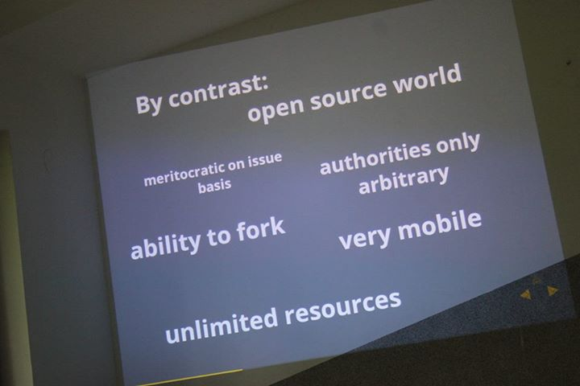

Title: 5th Offtopicarium - approaches to science
Slug: 5th-offtopicarium-approaches-to-science
Date: 2014-10-01 21:00
Lang: en

I'm writing this article on a train, coming back from the very latest [Offtopicarium], a Polish conference organized by scientists about sciences, but not exactly scientific. Held in both Polish and English (participants choose language they prefer), it's quite an intimate event, gathering no more than 25 people, 90% of whom with an active academic background.

The aim of Offtopicarium is to deal with all topics considered too 'loose' or 'in between' to be presented at a regular scientific conference. It covers various people's approaches and de-facto IS about various approaches to science. Some of the presentations contain large amounts of data - something major, on-topic conferences made us accustomed to - while others barely sketch the main idea and hope for a fruitful discussion, where any kind of hard data wouldn't be suitable.

A good example of the latter kind is a presentation about *Science Communication* (also Promotion and Education) by **Michal Krupinski**, as it painted all the contrasts between the Warsaw and Cracow approach to promoting scientific discoveries and knowledge.

On the other hand, **Błażej Kochański**'s *Selected Ills of the Polish Banks* were quite enlightening mainly *because* of all the data presented, showing how vicious cycles of loans are started and continue for years, without banks realizing the situation hurting both sides.

**Anna Kornakiewicz**, freshly-baked MD, asked a few valuable questions in her *How to Make Healthcare More Open? How to Allocate Resources in Healthcare?* - pondering about the meaning of a *medical hacker*, the possibilities of using external resources and technologies in hospitals, and the feasibility of cooperating with an external company/lab onsite.

The topic was continued by **Mikołaj Babiak** answering *Why Do We Need to be Faster Than Bacteria and How to do It* [(PDF)](/slides/5th_offtopicarium/Mikolaj_Babiak.pdf) by pointing the weaknesses of antibiotics and suggesting faster ways to find the most suitable treatment for a bacterial infections.

**Marcin Kurczych** led a talk on *Hypnosis - Witchcraft or Reality*, by both pinpointing the scientifically known facts about hypnosis, debunking the myths, and sharing the history.

**Emilia Wnękowicz** was another medical graduate at the conference, discussing *Regaining Sight After Long-Term Blindness*. Being a neuroscience enthusiast as I am I couldn't let her go without asking if there was any kind of research on regaining (or gaining) specific senses boosted by the use of nootropics. Sadly, neither of us knew of such papers.

I had the pleasure of sharing my thoughts and lead a discussion about *Opening Science*, slides of which are available at a wonderful portal [slid.es], or standalone on my server in [HTML] or [PDF] versions. I tried to show both the possibilities of using Open Access, and using non-academic resources such as Hackerspace or Makerspace experts willing to help in research.

Before proceeding to all the other presentations I think it's worth mentioning that this conference helped me understand the difference between a *geek* and a *nerd*, as defined by Western culture.

A lot of my friends since primary school were geeks. They loved stories, they loved ideas, they collected them and made their own: remixing, mastering, creating something more than the sum of its parts. But even when creative - they were always based on something pre-existing, created by someone else. They often focused on completing a collection or gaining a position in the fandom.

Nerds, on the other hand, are all about learning things. They want to know. They want to do research. That's their drive, which leads them to the academic world, often taking multiple majors (at once, or one after another). Even sharing a lot of culture with geeks (or even being geeks in addition to nerds, as some prefer), they leave superheroes and fantastic worlds just as Romans left their gods to become rhetorical figures - they focus on different things. Mainly science, with its many faces. Physics, chemistry and biology, but also anthropology, sociology and psychology. There is no difference between superman and a fullerene when it comes to jokes about culture, both being mentioned just as often.

And while geekiness is becoming more and more acceptable - and more and more mainstream, with people not feeling ashamed to read fantasy or sci-fi (which constitute major part of a modern cinema's offer), read anime and watch mangas &lt;/troll&gt;, there are still relatively few individuals finding pleasure in learning history, physics and biology just for fun.

Offtopicarium is a conference made by and for nerds.

I think that I may sum it up in one beautiful quote from the conference, when on a cold day one of the participants decided to wear blanket as a cape:
>What are you, a batman?

>No, a bacteriophage.

It was a festival and a tribute to passions and hard research the participants have spent a lot of time on, satisfying their own thirst for knowledge and sharing it with others.

Such was **Krzysztof Zieleniewski**'s *Mahan's Influence of "The Influence of Sea Power upon History" Upon Strategies Then and Now*: having read a remarkable history book he decided to show its brilliance to others, discussing its role in history and how it became obsolete (or didn't).

An hour long talk and discussion was led by **Jan Szejko**, covering *Constructed Languages*. I was impressed by the amount of work he put into it (especially the topic not being his thesis or PhD that I know of), trying to give us a sample of several languages (one of which declared data types for names and numbers). After his talk I realized I really miss some kind of synthetic language based equally on Latin and Asian languages, as I haven't heard of any such construct. I will not, however, be ever able to forgive the omission of [Sindarin] in favor of [Quenya]. High elves suck.

</img>'s *A Feminist Kinkster Critique of "50 Shades of Grey", or BDSM 101* [(prezi)](http://prezi.com/vrhctcb1ekw_/a-feminist-kinkster-critique-of-fsog/) was an unquestionable hit, especially backed up by heated discussions about LGBT community and non-traditional relationships she led before and afterwards.

**Anna Olchowik** had quite unique experience designing games to promote science, which she shared in *Serious Games in Education* [(PPT)](slides/5th_offtopicarium/anna_olchowik.ppt). Her presentation was remarkably refreshing after getting used to the startup babble, as Anna sees a goal behind her work and focuses on promoting knowledge and ideas, not implementing a new business model. Quoting her - *"Money on its own doesn’t work"*.

**Daniel Borek** held a talk about a philosophy of science - *How Explanation Explains*, which was probably the most inaccessible to me. Maybe it was my temporary inability to focus, maybe just natural allergy to particular kinds of philosophy, I enjoyed our following discussion about scientific black boxes and the idea of understanding the discovery much more. I highly recommend looking into the Peter Watts' latest book [Echopraxia] and real news: [computer solving Erdos problem] to understand the relevance of the issue.

**Dominik Kufel**, despite of being a highschool student, bravely debuted with an econophysics topic - *Wealth Through History*. As econophysics topics are either detailed, long and boring - or general and extremely controversial - this was the latter one.

**Magdalena Kasjaniuk** went through her baptism of fire speaking about the *Science of Makeup*. While the least scientific among the talks, it certainly pointed out some facts about a practice roughly half of human population is engaged in on a daily basis.

**Olga Pokorska** shared her passion of infant development in *Before Words*, which (maybe contrary to the speaker's intent) made me wonder if little children are just like extremely lonely, confused and frightened neural networks we may create at some point in time.

**Michał Gumiela** showed us a case study of *The Place of European CanSat Program in (Space) Education*, highlighting the ills of Polish mid- and high-schools not really prepared to cooperate - even if their own students are able to create teams winning European-level awards.

**Staszek Krawczyk** captured the essence of Offtopicarium by telling us that *"You Must Gather Your Party Before Venturing forth: Why Were Computer Games from 1990 so Important in Poland?* [(PDF)](slides/5th_offtopicarium/staszek_krawczyk.pdf) Led in a brilliantly nerdy way it mixed the nostalgia for Baldurs Gate games, statistical data of games popularity and insight into gamer's gender profiles.

Sadly, I was unable to stay for the Sunday evening's part to listen to other speakers - but I'm setting a full availability on the next year's edition as my priority.

**EDIT:** I managed to get some slides from the Sunday's presentations. Here you go:

**Dilation**: *PhysicsOverflow: A graduate-level upward physics site and open public peer-review system* [(PDF)](slides/5th_offtopicarium/PhysicsOverflow.pdf)

**Marcin Ziemniak**: *Synthetic life - beyond biology and chemistry* [(PDF)](slides/5th_offtopicarium/M-Ziemniak-Synthetic-life-2.pdf) with his summary: The seminar summarises the recent discoveries and development in biological chemistry which are connected to the idea of  synthetic life such as new synthetic analogues of DNA, extended genetic code and so called bioorthogonal chemistry, which allow us to introduce chemical modifications to proteins, nucleic acids and other biomolecules in the living organism. Another discussed idea is origin of a new biological discipline - xenobiology. This branch of science is exclusively dedicated to investigate the possibility (or even creation) a hypothetical life form having significantly altered biochemistry if compared to known organisms.

As to my own slides - the uploaded versions are the same I used at the conference. They contain some non-free images, legally used only for an educational purpose - but if you would like me to improve the presentation, please just contact me and I'll make it ready for future use in any role.

[Offtopicarium]: http://offtopicarium.wikidot.com/
[slid.es]: https://slides.com/pawelchojnacki/openingscience/
[html]: slides/5th_offtopicarium/openingscience.html
[pdf]: slides/5th_offtopicarium/openingscience.pdf
[computer solving Erdos problem]: http://www.independent.co.uk/life-style/gadgets-and-tech/news/computer-cracks-erds-puzzle--but-no-human-brain-can-check-the-answer-9137097.html
[Echopraxia]: http://rifters.com/
[Sindarin]: http://en.wikipedia.org/wiki/Sindarin
[Quenya]: http://en.wikipedia.org/wiki/Quenya
