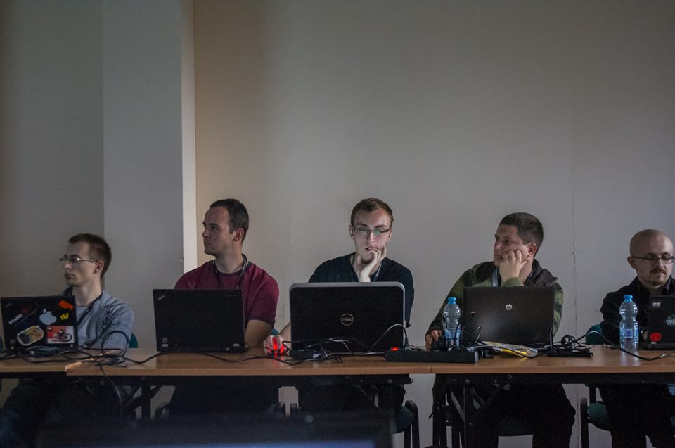

Title: PyConPL 2014 - mediocre hiring grounds for corporations
Slug: pyconpl-2014
Date: 2014-11-03 16:00
Lang: en
Category: conference, python

A beautiful, mountainous landscape of Szczyrk, Poland held the 7th edition of PyConPL, a conference for Python programmers. It's become a regular event in a Polish pythonista's calendar, and still holds its well-deserved reputation of hopeless mediocrity. This year its corporate sponsorship became plainly visible - if not aggressive, not even trying to pretend it's not about hiring.

It certainly didn't held to any international standards, even with the most basic aspect: language of the talks. Even though about 30% of the attendees didn't speak Polish, nearly half of the talks and workshops weren't held in English. What could pass in a strictly local meetup, such as Code Carrots or even PyWaw shouldn't have place on a nation-wide conference, with a lot of English speakers invited.

The absurdity of such decision may be best summarized by the opening talk, where one of the organizers stated:

> I'm honored to welcome you to the PyConPL! Yet, since it's a Polish conference, I will hold the rest of my speech in Polish...

Which left some attendees (including me) shocked. Pride from the nationality set aside, English is modern world's lingua franca, and allows to share the knowledge with the maximum number of listeners. It seems that this wasn't the goal of this conference.

While the hotel itself was a good place when it came to both accommodation and lecture halls, the organization failed in a lot of places. Firstly, there was no clear planning behind the timetable - no theme nor advancement level tracks, with number of simultaneous events ranging from 1 to 5, randomly. The plan itself wasn't presented clearly, disallowing people to decide which talk they want to attend. This sprang a lot of confusion, as the events took varied amounts of time. Some people hoped that this issue would be cured by a mobile app introduced only first day - which sadly proved unstable and wasn't able to cache data, also crashing quite often.

For some reason organizers decided not to inform attendees about the need to register for particular workshops by email - the information was put only on their page and facebook. Since not everyone uses PyConPL's RSS feed or follows them on the blue network - many people were left without any registration. The process itself was also quite strange, as the dates of the workshops were to be compared manually, with no clear distinction which two or three happen at the same time. Luckily, the messiness of this solution lead to a complete withdrawal from this model, and all workshops were freely accessible.

A lot of the talks and workshops weren't prepared right: in one of the halls the projector was placed in the lightest spot, making reading the console output on the display impossible. A lot of projectors couldn't display anything from Apple computers on the first try, and there was a general display converters shortage. Some of the lecturers didn't get proper ID, others were left with blank.

While the breakfasts, lunches and suppers were organized quite well by the hotel's staff, there were no drinks nor snacks between them, forcing attendees to buy their own water in a hotel's shop.

Not all of these faults are important, only several crucial, but they all were a real pain when experiencing the conference. That said, it's time to review the talks and workshops themselves, and they were very uneven.

The biggest flaw was a lack of clear advancement distinguishing (or just advanced tracks), with nearly all of them aspiring to show and teach something new and complex, yet focusing too much on the introduction and ending extremely basic. There were only several lectures where the speaker assumed audience's level of knowledge and continued freely.

And said audience was an active participant, which was one of the best things in the conference. Not only asking questions, but discussing, showing other examples, suggesting solutions. The most active commenters were awarded with Python books and video games, which is a nice touch.

Sadly, big number of the lectures was full of aggressive marketing. While pasting a company's logo on the first slide or in the background is perfectly understandable, why do we scrape the company main page for information? Why there's so much "And we're hiring!" at the end?

The lobby was full of companies' desks and recruiters. While some, such as DaftCode, remained pretty natural, others, like Nokia's HR department were attacking every passerby with offers and active ignorance, not able to tell apart Java from JavaScript.

Some nice contests took place - Red Hat's raffle for a red hat, STX algorithm creation competition, which was by far most interesting of them all. On the other side, Microsoft seemed to offend everybody's intellect with a quiz asking "How many Microsoft products can you buy for only a $100?".

While the atmosphere in the lobby remained mixed, there was a striking absence: no open source projects (except for OpenStack, which could be counted as a corporate), organizations, or even guerilla github encouragers. Some may read the conference's message as: we're about hiring, not helping you grow or create something worthwhile. Luckily, that changed with Lightning Talks at the end of each day, but before them let's review some most notable talks and workshops:

[Michal Kobus](https://github.com/Zhebr) led a talk "Snake goes micro" about MicroPython - python-programmable arduino-like boards, actually showing the hardware and programs he created with it.

Jacek Szpot with a (Polish, sadly) "Python Internals Uncensored" was the most charismatic of the speakers, a self-educator showing his latest discoveries when dwelling deep in to Python's basic mechanisms.

[Tomasz Maćkowiak](https://github.com/kurazu)'s "Proper Code Reviews" wasn't anything new, but a handy summary of everything worth knowing about code review - or a great introduction for beginners.

[David Fisher](http://www.glasspanther.com/) went with something completely different in "Developer & Designer: A Love Story", showcasing why cooperation between designers and programmers is important at every step of the projects - and how lack of any of them can completely ruin the outcome.

[Szymon Pyżalski](https://github.com/zefciu)'s "Everything what's wrong with Python" finally created a competent Python critique, with clear and valid arguments which should be kept in mind when creating the next step in Python 3.

[Jacek Kołodziej](http://kolodziejj.info/)'s "asyncio-nous" was masterly clear and to the point, one of the most solid presentations on the conference.

[Peter Inglesby](https://github.com/inglesp) led a workshop called "Writing Maintainable Code", which was rather a short and easy exercise of creating clear programing concepts and executing them - but taken as so, would be invaluable for young programmers.

[Haris Ibrahim](https://github.com/harisibrahimkv) offered to help "Learn Django and Redis by visualizing Twitter data" - which was one of the best introductory courses of Django I've ever taken.

The fact that this list consist mainly of beginner-level or unrelated to the language itself presentations may say a lot about the profile of this conference. Luckily, lightning talks presented a lot of nice open source ideas, such as [Saleor](http://blindstore.github.io/) (Satchless fork), [Blindstore](http://blindstore.github.io/) (completely private database), or using Sage Notebook to teach physics.

The complete list of presentations and workshop materials can be found at the conference's [Github](https://github.com/PyConPL/Book/tree/master/2014), what I learned by accident, just seconds before publishing this blogpost. While this is indeed a nice touch I think that organizers could be *a little* more verbose about that.

Another disturbing question (especially after the [Czech discussion](https://www.youtube.com/watch?v=G-9VgEtK4Y8)) was misogyny, or rather sexualization of women attending the conference. Even though the Code of Conduct was stated quite clearly at the very beginning, some participants reported being groped during the ending grill party.

Summing it up, PyConPL had a specific reputation, which it managed to hold for another year. It's a place for Polish Python community to meet (and get recruited), to get to know each other (not forgetting our local redneckness) but it's certainly not a national-scale meetup with a purpose of sharing knowledge and creating something new.

Just a couple of programmers with beers.
