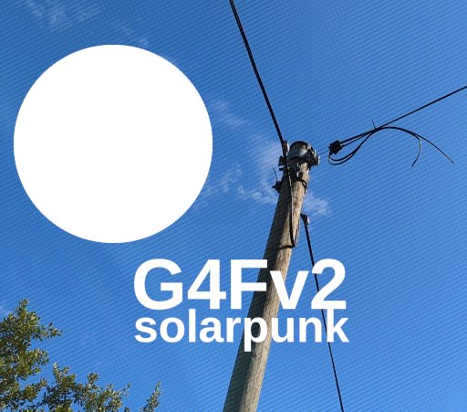

Title: "Games for Future 2: Solarpunk" - a game design lecture at Burg Giebichenstein University of Art and Design Halle
Date: 2024-05-13
Slug: games-for-future-2
Lang: en
Translation: false
opengraph_image: 50_games_for_future/logo.jpg

On the 9th of April 2024 I was invited to give a Solarpunk Game Design lecture within the "[Games for Future v2: Solarpunk](https://gamesforfuture.de/)" course for Multimedia | VR-Design (B.A.) & Multimedia Design (M.A.) students of the [Burg Giebichenstein University of Art and Design Halle](https://www.burg-halle.de/en/) in Germany.

You can find the recording of my lecture on [Vimeo](https://vimeo.com/939075754) (sadly, without the Q&A with the students).

Please feel free to check out the project's [wiki](https://gamesforfuture.de/wiki/doku.php?id=start) as well as its [pad](https://yopad.eu/p/gf4_manifesto) and [zine](https://gamesforfuture.de/zine/)!

I mostly focused on defining Solarpunk and sustainable futures and analyzing how to present them using [emergent gameplay](https://en.wikipedia.org/wiki/Emergent_gameplay) and emergent narratives, allowing players to intuitively and implicitly understand a lot of the issues which could be hard to communicate explicitly. Some of my examples feature the subtle mechanical encouragement to interact with the community in [I Was A Teenage Exocolonist](http://exocolonist.com/) and geopolitcally problematic gameplay balancing of [Daybreak](https://daybreakgame.org/). 

Huge thanks to professor [Jonas Hansen](https://troet.burg-halle.de/@jonashansen) for inviting me and organizing such a wonderful course!