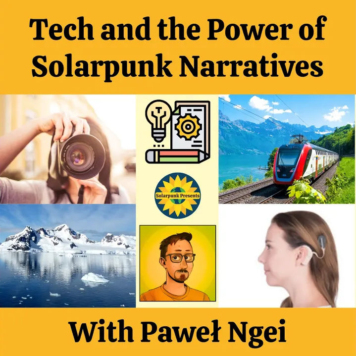

Title: Solarpunk Presents interview - "Tech and the Power of Solarpunk Narratives, with Paweł Ngei"
Date: 2024-05-30
Slug: solarpunk-presents-interview
Lang: en
Translation: false
opengraph_image: 51_solarpunk_presents/cover.jpg

On the 27th of May 2024 the [Solarpunk Presents](https://www.solarpunkpresents.com/) podcast published an interview with me, available on [YouTube](https://www.youtube.com/watch?v=ilMcperL3U8), [Spotify](https://open.spotify.com/episode/5EMqCo3x4wuVebpCgX4g35?si=7dd7089e785c4ab7) and [Google Podcasts](https://podcasts.google.com/feed/aHR0cHM6Ly9mZWVkcy5hY2FzdC5jb20vcHVibGljL3Nob3dzLzYzZDY4MGM4YWM3YmI2MDAxMTg5OTE4OQ/episode/NjY1MmVjMGFiN2UwOWEwMDEyMjhkZjU2). I would like to thank [Christina](https://germanium-geranium.com/) for the invitation to the podcast and a wonderful conversation!

We discussed how the depictions of technology in our culture shape our imaginations of the future, how our treatment of disabled people allows us to see our biases more clearly, what [appropriate technology](https://www.appropedia.org/Welcome_to_Appropedia) is and how we could start seeing every tech as infrastructure, not artifacts! We also looked at the (often invisible) power structures present when not everybody understands how a technology works. Christina really liked the idea of telling a Solarpunk story through a generational soap opera focusing on a family or a community!

If at any point I make little sense, I have to thank my doggo for a very early morning wake-up ;)

About the podcast:

> Solarpunk Presents is a podcast that explores the people and projects working on bringing us a better world today.

> Solarpunk is more than just an idea, more than just an aesthetic. Those inspire us, but where do we go from there? How do we put the values and visions described in solarpunk fiction and art into action in the here and now? What does that look like, translated into the reality of our present moment, into the places and spaces where we’re at? Hosts Ariel Kroon and Christina De La Rocha are producing podcast episodes featuring interviews with people working to make the world a better place right now, as well as discussions of solarpunk, DIY, aesthetic, housing, and more. Join us as we explore what #solarpunk looks like in the present.

