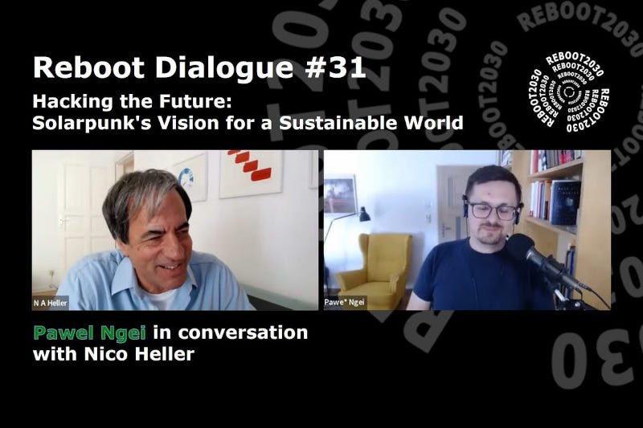

Title: Reboot 2030 - Hacking the Future: Solarpunk Vision for a Sustainable World
Date: 2024-07-10
Slug: reboot-2030-hacking-the-future
Lang: en
Translation: false
opengraph_image: 52_reboot_2030/cover.jpg

On the 9th of July 2024 I had a pleasure of giving an interview to Nico Heller from the [Democracy School](https://www.democracyschool.com/), as a part of his [Reboot 2030](https://reboot2030.substack.com/) project! 

You can listen to the interview on [YouTube](https://youtu.be/yczc3CFhwQE) and [Reboot 2030 Substack](https://reboot2030.substack.com/p/hacking-the-future-solarpunks-vision) as well as [Spotify](https://open.spotify.com/episode/0fAzSRbrrd97NMnPAWtt98?si=18d0167de0534868) and other podcasting platforms!

The project defines itself as:

> Are we headed irreversibly towards catastrophe or do we have what it takes to fundamentally remake our world in time, sustainably, regeneratively and equitably? If so, who are the people and organisations that drive the transition to a sustainably regenerative negative carbon economy and a better life for all? To shed some light on these questions we have created Reboot2030, a podcast and YouTube channel that engages transformational leaders in ongoing dialogues about their vision and work.

This episode's description:

> In an era of multiple global crises – from the climate emergency, to rising populism and the existential threats posed by rapid developments in AI – positive visions of a sustainable and regenerative future are urgently needed.

> This episode of Reboot2030 explores solarpunk, an emergent movement gaining traction for its life-affirming outlook. We unpack its potential for revitalising democracy and social movements, examine how solarpunks propose balancing technological advancement with sustainability, and explore ways of democratising big tech in an age of techno-feudalism to enable the emergence of alternative social structures.

> Joining us is Pawel Ngei, a hacker and solarpunk researcher focusing on narratives of technology in culture, especially climate futurism. He works with Global Innovation Gathering, collaborating with inventors and educators from the Global South to discover new, community-based perspectives on tech and culture.

It was a pleasure to discuss Solarpunk with Nico, introducing the movement to people interested in democracy and non-doomed visions of our future. I really enjoyed his observation that most of Solarpunk technologies I promote are not energy-focused, but networking- and communication- focused. It's a really good insight into what might be most important in a Solarpunk future: a human-centered dialogue instead of algorithmic decision-making.