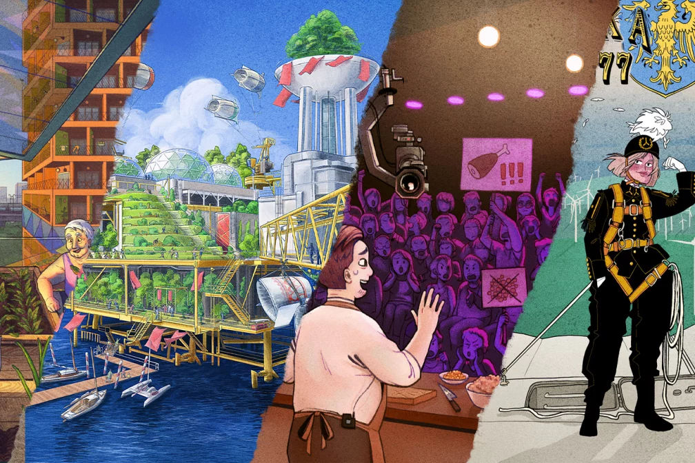

Title: Solarpunk w INN:Poland
Date: 2024-12-30
Slug: solarpunk-w-innpoland
Lang: pl
Translation: false
opengraph_image: 54_solarpunk_innpoland/banner.jpg

<figcaption markdown="1">
  Ilustracja tekstu z INN:Poland używająca fragmentów ilustracji The Lemonaut, PannyN i Commando Jugendstil dostępnych na [solarpunk.pl](https://solarpunk.pl/ilustracje/)
</figcaption>

W INN:Poland pojawił się artykuł Sebastiana Luc-Lepianki pod tytułem [Solarpunk – ruch społeczny, który może przemówić do ludzi bardziej niż akcje Ostatniego Pokolenia](https://innpoland.pl/209981,co-to-jest-solarpunk-solarpunkowe-manifesto). Wprowadza on czytelników w tematykę Solarpunka, odnosi go do obecnych w Polsce protestów klimatycznych i opowiada o jego relacji z wiecznie-zjadającym-idee kapitalizmem. Artykuł obszernie cytuje moje własne komentarze oraz odwołuje się do pracy [Fanpage Ekofikcji](https://www.facebook.com/ekofikcje/).

Więcej artykułów o ruchu, manifestów i opowiadań można znaleźć na stronie [solarpunk.pl](https://solarpunk.pl/zrodla/).